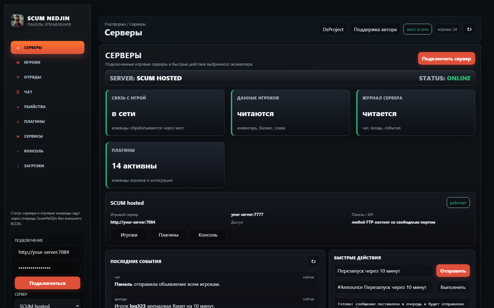
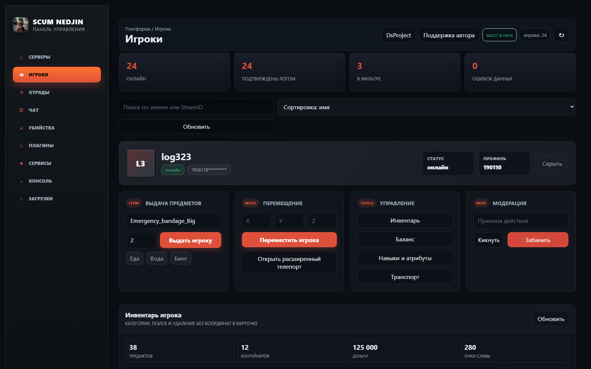
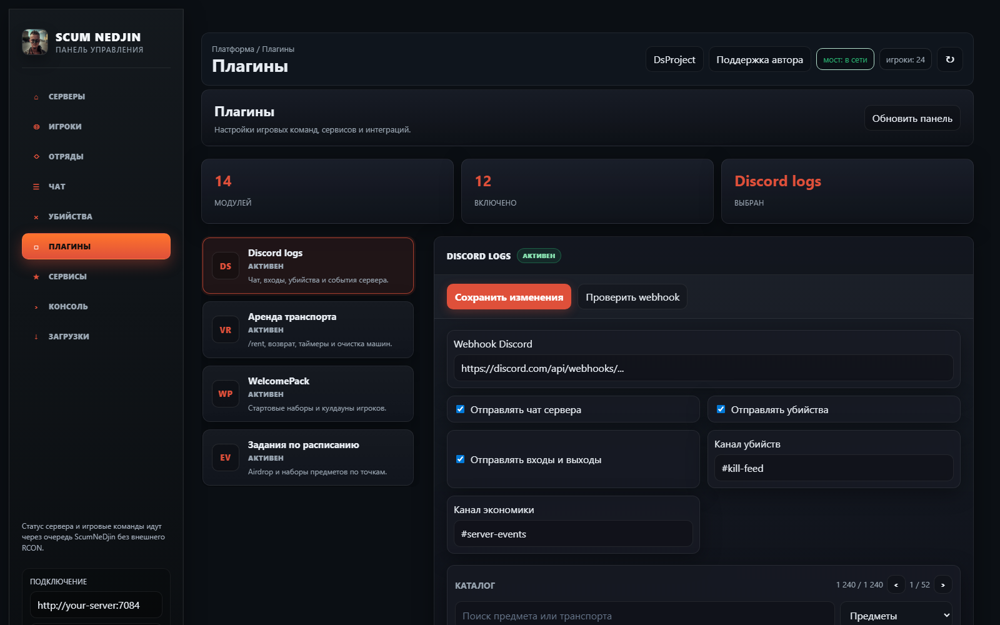
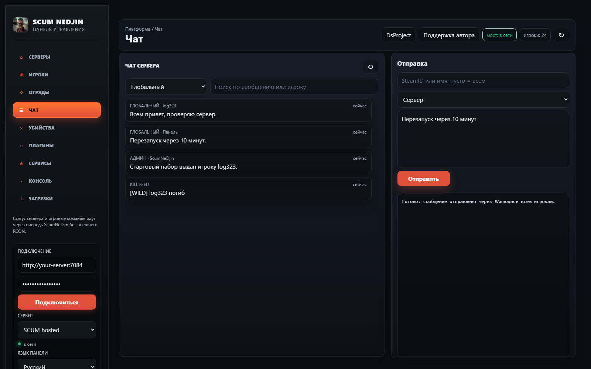

# SCUM NeDjin

SCUM NeDjin - бесплатный публичный клиентский релиз веб-панели управления SCUM-сервером. Панель ставится через FTP, работает через собственный игровой мост и не требует внешнего RCON.

[Скачать последний релиз](https://github.com/noginegun-web/ScumNeDjin-Release/releases/latest)

## Возможности

- Подключение панели к серверу по любому открытому TCP-порту.
- Доступ к панели из браузера с ПК, ноутбука или телефона при наличии адреса и ключа доступа.
- Карточка игрока: выдача предметов, баланс, золото, очки славы, навыки, атрибуты, транспорт и модерация.
- Инвентарь игрока: поиск, категории, дерево контейнеров и удаление предметов из карточки.
- Чат сервера: просмотр логов и отправка объявлений всем игрокам через игровую команду.
- Каталоги предметов и транспорта с поиском, категориями и постраничным просмотром.
- Набор игровых плагинов: welcome pack, daily pack, home, fast travel, private messages, sector scan, bounty, Wargm, аренда транспорта, kill feed и задания по расписанию.
- Discord-логи для чата, убийств, входов, выходов и серверных событий.
- Очередь команд, чтобы не перегружать SCUM-сервер и не терять действия при задержках.

## Скриншоты

## Установка на любой хостинг

1. Остановите SCUM-сервер в панели хостинга.
2. Распакуйте архив релиза.
3. Загрузите папку `ScumNeDjin` через FTP в папку сервера, рядом с игровыми файлами `SCUM/Binaries/Win64`.
4. Откройте `ScumNeDjin/nedjin.ini`.
5. Укажите свободный порт в `port`.
6. Замените `api_key=CHANGE_ME_STRONG_PANEL_KEY` на свой длинный ключ.
7. Убедитесь, что выбранный TCP-порт открыт на хостинге.
8. Запустите SCUM-сервер.
9. Откройте панель: `http://IP_СЕРВЕРА:PORT`.

Проект не привязан к конкретному хостингу, IP или порту. Нужны только FTP-доступ к файлам сервера и возможность открыть порт для панели.

## Что входит в релиз

- `ScumNeDjin` - готовая папка панели и моста.
- `INSTALL_CLIENTS_RU.md` - подробная инструкция для клиентов.
- `INSTALL_RU.txt` - короткая инструкция установки.
- `nedjin.ini` с безопасным шаблоном ключа.
- SHA256-файл для проверки архива.

## Проверка после установки

После запуска проверьте в панели:

- статус `мост: в сети`;
- список игроков после входа игрока на сервер;
- сохранение и включение плагинов;
- отправку сообщения во вкладке `Чат`;
- выдачу предмета и чтение инвентаря в карточке игрока;
- Discord webhook, если включены Discord-логи.

## Безопасность

Не оставляйте стандартный `api_key`. Используйте длинный уникальный ключ и не публикуйте его в чатах, скриншотах или тикетах. Публичный релиз не содержит приватных исходников, рабочих FTP-доступов, клиентских IP и истории разработки.
